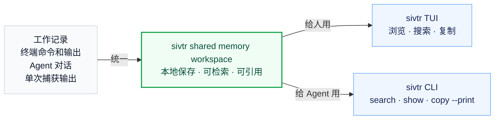

> 把终端记录和 Agent 对话统一成一个本地、可检索、可引用的 shared memory workspace。

理解 `sivtr` 要分成两层：

1. **记忆层**：终端命令、命令输出、Agent session、对话和工具结果如何变成共享 workspace memory。
2. **使用层**：人如何用 TUI 浏览这份记忆，Agent 如何用 CLI 检索和展开这份记忆。



| 层 | 关心的问题 | 关键词 |
| --- | --- | --- |
| 记忆层 | 内容从哪里来，如何被组织 | source、session、dialogue、block、ref |
| 使用层 | 人和 Agent 怎么取用这份记忆 | TUI、search、copy、show、diff、skill、playbook |

## 第一层：记忆如何组织

Workspace memory 来自多个 source，但进入 `sivtr` 后会被组织成相似的结构。

### Source：记忆来源

Source 是记忆从哪里来。

| Source | 内容 | 示例 |
| --- | --- | --- |
| Terminal | 最近终端命令和输出 | `bun run build`、`cargo test` |
| Claude | Claude Code 本地 session | 用户消息、助手回复、工具结果 |
| Codex | Codex 本地 session | rollout / transcript |
| OpenCode | OpenCode 本地 session | 对话和工具调用 |
| Pi | Pi 本地 session | 对话、工具调用、执行记录 |
| Pipe / run | 单次捕获输出 | `cargo test 2>&1 \| sivtr`、`sivtr run cargo test` |

这些 source 的格式各不相同，但在 workspace TUI 和搜索结果里会被放到同一个入口下。

### Session：一次连续工作记录

Session 是来自某个 source 的一段连续记录。

- Terminal session：一组最近命令块。
- Agent session：某个 Agent 的一次本地对话记录。
- Pipe / run session：一次临时捕获的长输出。

Session 不是最终用户必须记住的概念；它主要用来帮助你在 workspace 中定位：这是哪次终端工作？哪次 Agent 对话？

### Dialogue / block：可复用的最小工作单元

不同 source 里的最小单元不一样：

| Source | 单元 |
| --- | --- |
| Terminal | command block：一条命令 + 它的输出 |
| Agent | dialogue：一轮用户消息、助手回复、工具调用或工具输出 |
| Pipe / run | captured block：一次捕获输出 |

这些单元是复制、搜索、引用时最常用的粒度。比如：

- 复制最近一次命令输出；
- 找到某个 Agent 曾经做出的决策；
- 展开某次失败构建的完整日志；
- 引用某轮对话作为 handoff 证据。

## 第二层：记忆如何使用

同一份 workspace memory 有两种主要使用方式。

### 给人用：workspace TUI

人通常先打开统一 workspace：

```bash
sivtr
```

这个 TUI 把 terminal 和 Agent sessions 放在一起。你可以：

- 在 Source 面板切换 terminal、Claude、Codex、OpenCode、Pi；
- 在 Sessions 面板选择某次工作记录；
- 在 Dialogues 面板选择某条命令块或某轮对话；
- 在 Content 面板查看具体内容；
- 用 `/` 搜索 workspace；
- 用 `i` / `o` / `y` / `c` 复制输入、输出、块或命令。

这是一种面向人的记忆浏览方式：先看，再搜，再选，再复制。

### 给 Agent 用：CLI 检索

Agent 通常不需要打开 TUI。它应该使用非交互式命令读取同一份记忆：

```bash
sivtr search "error|failed|panic" --json --limit 20
sivtr copy out 1 --print
sivtr show terminal/current/2 --json
```

这是一种面向 Agent 的记忆读取方式：先搜索，再展开精确内容，再根据当前文件和验证结果行动。

## 两种定位方式：Selector 和 Ref

Selector 和 Ref 是 `sivtr` 中定位 shared workspace memory 的两种方式。

### Selector：按最近顺序取内容

Selector 用在 `copy` / `diff` 这类命令中，适合取"最近发生的内容"。

| Selector | 含义 |
| --- | --- |
| 省略 | 最新项，也就是 `1` |
| `1` | 最新项 |
| `2` | 上一项 |
| `2..4` | 一段最近范围 |

示例：

```bash
sivtr copy out 1 --print
sivtr copy cmd 1..10 --print
sivtr diff 1 2
```

### Ref：回到精确证据

Ref 用在 `show` 中，适合回到搜索结果指向的精确位置。

```text
source/session[/dialogue[/block]]
```

示例：

```bash
sivtr show terminal/current/2
sivtr show claude/<session-id>/3
sivtr show claude/<session-id>/3/2
```

`search --json` 会输出 ref，所以人和 Agent 都可以先搜索，再用 ref 展开同一份证据。

## Commands

可以用这些命令打开、搜索、复制、展开、比较或临时捕获 workspace memory：

| 命令 | 用途 |
| --- | --- |
| `sivtr` | 打开统一 workspace TUI |
| `sivtr copy` | 按 selector 复制最近终端块 |
| `sivtr copy <provider>` | 读取某个 Agent provider 的 session 内容 |
| `sivtr search` | 跨 terminal 和 Agent sessions 搜索 workspace memory |
| `sivtr show` | 用 ref 展开精确内容 |
| `sivtr diff` | 比较两个最近终端命令块 |
| `sivtr run` / pipe | 临时捕获并浏览单次命令输出 |

## Skills 和 playbooks 在哪一层

Skill 和 playbook 是使用层上的流程。它们告诉 Agent 在某个场景下如何检索、展开和验证 workspace memory。

例如，"修复最近的终端报错"可以使用这套检索方式：

```bash
sivtr search "error|failed|panic|Traceback|Exception|exit code|FAILED" --json --limit 20
sivtr copy out 1 --print
sivtr copy cmd 1..10 --print
```

然后 Agent 再根据代码和验证结果继续工作。

## Local-first

`sivtr` 默认读取本机上的终端记录和 Agent session。本地数据、统一入口和可追溯引用，让它适合作为 workspace memory 入口。
